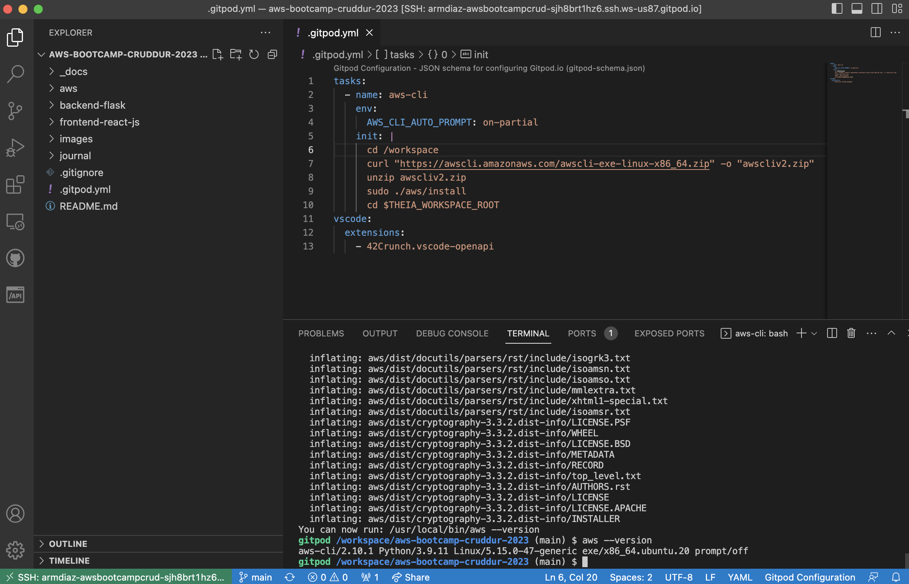
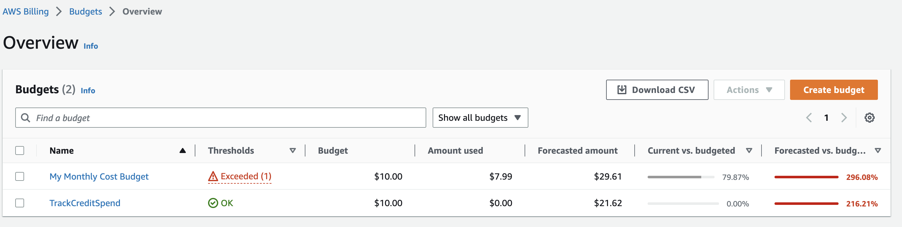
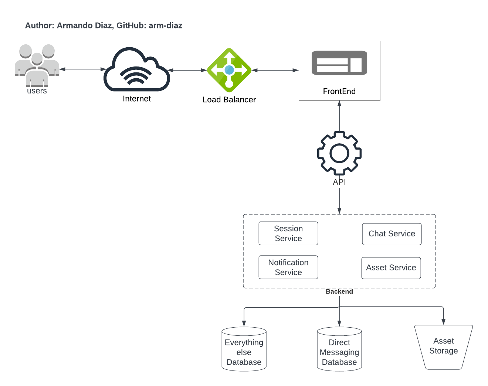
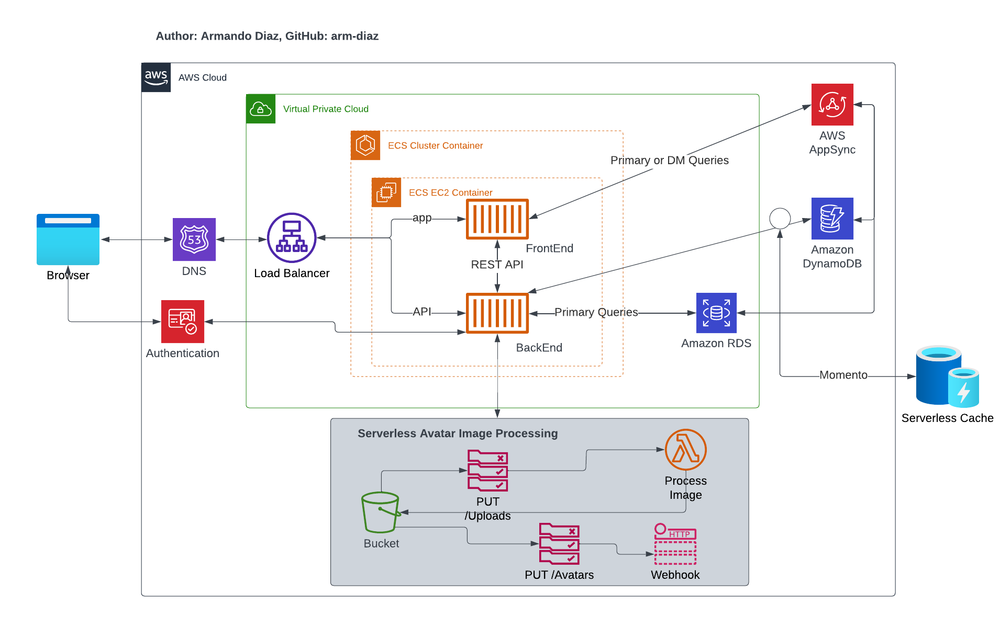

# Week 0 — Billing and Architecture

## Required Homework/Tasks

### Install and Verify AWS CLI 

I worked on Gitpod using the Chrome extension to open the working environment.

The configurations and instructions that I followed to install AWS CLI are described below:

- Install the AWS CLI in GitPod and VSCode following the bash commands in AWS Documentation Page. See more [AWS CLI Install Documentation Page](https://docs.aws.amazon.com/cli/latest/userguide/getting-started-install.html)
- Update `.gitpod.yml` file to include the AWS Installation steps and be able to access AWS CLI when Gipod is restarted.
- No errors were found. Image shows `aws --version` runs successfully.

```sh
tasks:
  - name: aws-cli
    env:
      AWS_CLI_AUTO_PROMPT: on-partial
    init: |
      cd /workspace
      curl "https://awscli.amazonaws.com/awscli-exe-linux-x86_64.zip" -o "awscliv2.zip"
      unzip awscliv2.zip
      sudo ./aws/install
      cd $THEIA_WORKSPACE_ROOT
```



### Create a Budget

I created my own Budget for $10 because I feel comfortable spending up to 10 dollars. Getting a notification when exceeding more than 10 dollars will help me take actions and avoid overspending.

I created two Budgets because I have some AWS credits available in my account and I would like to keep track of them when they are applied. That will give me a better perspective of how much I am spending instead of being too optimistic with my expenses.

The Budget Alarms were created in AWS Console and I also followed the instructions in AWS Documentation Page to use the AWS CLI and replicate the alarms via CLI and JSON files. See JSON configuration files: 
[aws/json/budget-alarm](https://github.com/arm-diaz/aws-bootcamp-cruddur-2023/tree/main/aws/json/budget-alarm)

AWS Documentation References:

- [Create a Budget, notifications, and subscribers](https://docs.aws.amazon.com/cli/latest/reference/budgets/create-budget.html)
- [Create SNS Topic](https://docs.aws.amazon.com/cli/latest/reference/sns/create-topic.html)
- [Subscribe an endpoint to SNS Topic](https://docs.aws.amazon.com/cli/latest/reference/sns/subscribe.html)
- [Create Billing Alarm](https://docs.aws.amazon.com/cli/latest/reference/cloudwatch/put-metric-alarm.html)

For example, creating a Budget Alarm to track credits spend is described as follows:

```sh
aws budgets create-budget \
    --account-id AccountID \
    --budget file://aws/json/budget-alarm/credits/budget.json \
    --notifications-with-subscribers file://aws/json/budget-alarm/credits/budget-notifications-with-subscribers.json
```

 

### Recreate Conceptual Architectural Deisgn



[Lucid Charts Share Link](https://lucid.app/lucidchart/4d1a0d95-516f-4ecf-99c5-a69b63f78786/edit?viewport_loc=-119%2C103%2C2805%2C1437%2C0_0&invitationId=inv_62401b64-b767-4395-ba3a-c5814f3bd57a)

### Recreate Logical Architectural Deisgn



[Lucid Charts Share Link](https://lucid.app/lucidchart/4d1a0d95-516f-4ecf-99c5-a69b63f78786/edit?viewport_loc=-119%2C103%2C2805%2C1437%2C0_0&invitationId=inv_62401b64-b767-4395-ba3a-c5814f3bd57a)
