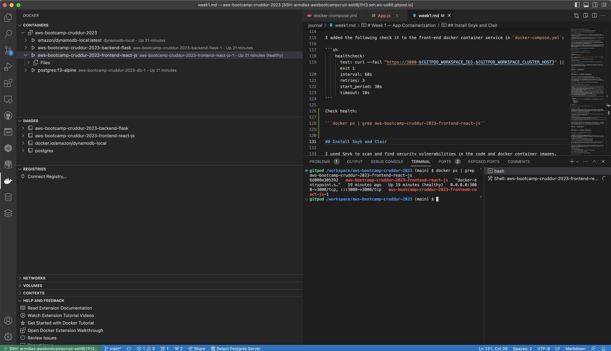
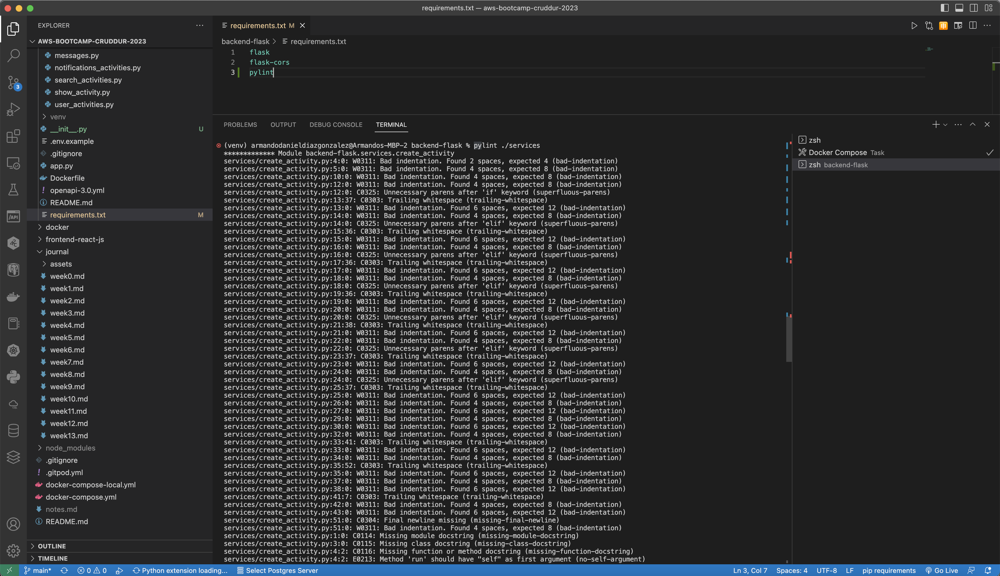
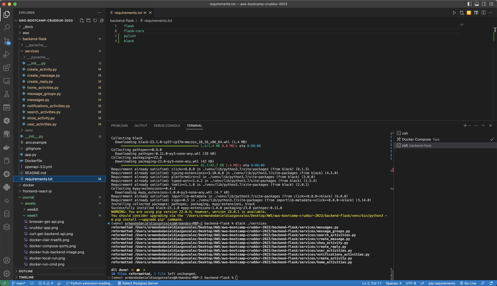

# Week 1 — App Containerization

## Required Homework/Tasks

### Containerize Application (Dockerfiles, Docker Compose)

First I installed the [Docker VS Code Extension](https://code.visualstudio.com/docs/containers/overview) to help me build, manage, and deploy containerized applications. Updated `.gitpod.yml` file to include the Docker Extension ID and be able to access Docker when Gitpod is restarted.

Then, I included the Docker files for [backend](https://github.com/arm-diaz/aws-bootcamp-cruddur-2023/tree/main/backend_flask/Dockerfile) and [frontend](https://github.com/arm-diaz/aws-bootcamp-cruddur-2023/tree/main/frontend-react-js/Dockerfile) applications. I also **customized** the **code** and **web app** with my name `Armando Diaz` for grading purposes.

I executed the following command to test the backend was running successfully. 

```sh
curl -X GET http://localhost:4567/api/activities/home -H "Accept: application/json" -H "Content-Type: application/json"
```
 

After that, I created a `docker-compose.yml` file to handle multiple containers at once and orchestrate applications.

- The `docker-compose` file included `backend` and `frontend` at this stage of the project.
- After deployment, the `frontend` did not show any data and I had to debug the containers and code. 
- First, I checked the ports `3000` and `4567` on Gitpod were public.
- Seond, I used `inspect` in browser and looked for any error messages under the console section. There was a `CORS` error message pointing out to the fronend endpoint and backend endpoints.
- Third, I opened docker logs for both services to look for any errors.
- Forth, I reviewed the code on both services, displayed some information using `print` for the backend and `console.log` for the frontend.
- Fifth, I realized the *decorator* function `@cross_origin()` was missing in all the methods on `backend_flask/app.py` and the class `ShowActivity` was misspelled. This solved the problem.

### Create the notification feature (Backend and Front)

For this part, all instructions were provided on YouTube and I added/modified the following files:

- Backend:
  - [notifications_activities](https://github.com/arm-diaz/aws-bootcamp-cruddur-2023/tree/main/backend_flask/services/notifications_activities.py)
  - [app](https://github.com/arm-diaz/aws-bootcamp-cruddur-2023/tree/main/backend_flask/app.py)
- Frontend:
  - [NotificationsFeedPage](https://github.com/arm-diaz/aws-bootcamp-cruddur-2023/tree/main/frontend-react-js/src/pages/NotificationsFeedPage.js)
  - [App](https://github.com/arm-diaz/aws-bootcamp-cruddur-2023/tree/main/frontend-react-js/src/App.js)

No errors were found during the process of this step.


### Run DynamoDB and Postgres

In this step, I included the configurations to run a Dynamodb local container and Postgres container in the [docker-compose.yml file](https://github.com/arm-diaz/aws-bootcamp-cruddur-2023/tree/main/docker-compose.yml).

- I added the extension `cweijan.vscode-postgresql-client2` in `.gitpod.yml`. That extension is a database client to create a connection with Postgres via VS Code. 
- I also tested the Postgress Connection via `psql` running th command `psql -Upostgres --host localhost`.


After that, I created a table and inserted some records to test the connectivity with Dynamodb Local. The commands can be found in the repository [100DaysOfCloud/challenge-dynamodb-local](https://github.com/100DaysOfCloud/challenge-dynamodb-local).

In addition, I wanted to use a DynamoDB client to query and visualize tables in a human-readable manner. I installed [NoSQL Workbench](https://docs.aws.amazon.com/amazondynamodb/latest/developerguide/workbench.html) for Amazon DynamoDB which provides a GUI application for Windows, macOS, and Linux.


## Homework Challenges

### Run the Dockerfile CMD as an external script

I installed the python libraries using `pip` as follows:

```sh
cd backend_flask
pip install -r requirements.txt
```

Then, I executed the command ```python3 -m flask run --host=0.0.0.0 --port=4567``` and checked the api on my browser.


Documentation References:

- [How to run a flask application](https://www.twilio.com/blog/how-run-flask-application)

## Push and tag an image to DockerHub

I built the backend images using `v{num}` to version and tag docker images. I simulated two versions of docker and run each container in a different port. This could be useful to simulate how distributed applications are executed.

- Build image
  
```sh
docker build ./ -t cruddur-backend:v1
docker build ./ -t cruddur-backend:v2
```

- Run container

```sh
docker container run --rm -p 4567:4567 -d cruddur-backend:v1
docker container run --rm -p 4568:4567 -d cruddur-backend:v2
```


Then, I tagged the image `v2` using the command `docker tag cruddur-backend:v2 armdiaz/cruddur-backend:latest`. Finally, I pushed the image using the command `docker push armdiaz/cruddur-backend:latest`. Too see docker image in Docker Hub [click here](https://hub.docker.com/r/armdiaz/cruddur-backend).


## Healthcheck in the Docker files

The Docker Compose Healtcheck contains five properties:

- test: This property specifies the command that will be executed and is the health check of the container.
- interval: This property specifies the time to wait before executing the health check and then the frequency at which subsequent health checks will be performed.
- timeout: This property specifies the time Docker awaits for your health check command to return an exit code before declaring it as failed.
- retries: This property specifies the number of consecutive health check failures required to declare the container as unhealthy.
- start_period: This property specifies the time your container needs to bootstrap. During this period, health checks with an exit code greater than zero won’t mark the container as unhealthy; however, a status code of 0 will mark the container as healthy.
- [Reference](https://www.atatus.com/blog/health-check-command-in-docker/): [To see more details click here](https://medium.com/geekculture/how-to-successfully-implement-a-healthcheck-in-docker-compose-efced60bc08e)

I added the following check it to the front-end docker container service in `docker-compose.yml`:

```sh
    healthcheck:
      test: curl --fail "https://3000-${GITPOD_WORKSPACE_ID}.${GITPOD_WORKSPACE_CLUSTER_HOST}" || exit 1
      interval: 60s
      retries: 3
      start_period: 30s
      timeout: 10s
```

Check docker health:

```sh
docker ps | grep aws-bootcamp-cruddur-2023-frontend-react-js
```



## Install Snyk and Clair

I used Snyk to scan and find security vulnerabilities in the code and docker container images. Snyc manages vulnerabilities applying severity levels to indicate the risk for that vulnerability in an application. It helped me identify many vulnerabilities, for example, upgrading the base image of nodejs will decrease critical vulnerabilities.


I also explored [clair](https://github.com/quay/clair) which is used to index container images and then match it against known vulnerabilities.

Documentation References:

- [Clair](https://quay.github.io/clair/howto/testing.html)
- [Traefik](https://doc.traefik.io/traefik/v2.2/getting-started/quick-start/)


## Install Docker on localmachine

I already had installed Docker on my localmachine. However, the `docker-compose.yml` was failing because `FRONTEND_URL` and `BACKEND_URL` were pointing out to Gitpod endpoints. To fix this issue, I replaced the values with `http://localhost:3000` and `http://localhost:4567`. I created  a new `docker-compose-local.yml` file to run the containers in my local environment.

```sh
docker build ./ -t backend/cruddur:v1
docker build ./ -t backend/cruddur:v2
```

```sh
docker container run --rm -p 4567:4567 -d backend/cruddur:v1
docker container run --rm -p 4568:4567 -d backend/cruddur:v2
```


## Install Eslint for JavaScript

I installed [Eslint](https://eslint.org/docs/latest/use/getting-started#:~:text=ESLint%20is%20a%20tool%20for,can%20add%20more%20at%20runtime.), a tool for identifying and reporting on patterns found in JavaScript code, with the goal of making code more consistent and avoiding bugs.

- Installed the VS Code plugin and added the ID in `.gitpod.yml`.
- Created a `.eslintrc.json` file for react-javascript projects.


Results helped me see quickly which libraries, methods, parameters, references were not being used. It helped identify some bugs and things that I will likely improve for future work.

## Install Linter for Python

I installed [Pylint](https://pylint.pycqa.org/en/latest/user_guide/usage/run.html), a tool that checks for errors in Python code and tries to enforce a coding standard. You can test Pylint by running the following command `pylint ./directory`

Documentation References:

- [Docs](https://docs.pylint.org/)
- [Tutorial](https://www.jumpingrivers.com/blog/python-linting-guide/)

Results helped me find errors/bugs in the code. 



## Auto-formatters in Python

I installed [Black](https://black.readthedocs.io/en/stable/), a code formatter that automatically adjusts your Python code after a well-defined rule set. You can test Black by running the following command `black ./directory`

Documentation References:

- Black can be integrated in Git using [pre-commit github](https://github.com/pre-commit/pre-commit)
- [Automate Python Code Formatting With Black and pre-commit](https://medium.com/gousto-engineering-techbrunch/automate-python-code-formatting-with-black-and-pre-commit-ebc69dcc5e03)
- [pre-commit docs](https://pre-commit.com/)
- [Getting Started with Python Pre-commit Hooks](https://towardsdatascience.com/getting-started-with-python-pre-commit-hooks-28be2b2d09d5)

Black helped me increase high-quality code.


