# Week 2 — Distributed Tracing

## Required Homework/Tasks

### Traces within Honeycomb.io

First I created a [Honeycomb account](https://www.honeycomb.io/) and then created an environment variable `HONEYCOMB_API_KEY` that lets connects to Honeycomb via python SDK. Updated `docker-compose.yml` file to include other environment variables that are required to use Open Telemetry (OTEL) with Honeycomb.io as the provider.

After that, I decided to work on `services/home_activities.py` to test each tracer tool (Honeycomb, CloudWatch, XRay, and Rollbar). To control which tracer/logger will be used by Cruddur, I used a `if statement` which relies on an enviroment variable to decide which tracer runs.

For Honeycomb, the code looks like follows:

```python
if os.getenv("ENABLE_HONEYCOMB_LOG"):
    with tracer.start_as_current_span("home-activities-mock-data"):
        span = trace.get_current_span()
        span.set_attribute("app.now", now.isoformat())
        results = HomeActivities.get_data(now)
        span.set_attribute("app.result_length", len(results))
        return results
```

This implementation is straight forward and I did not experience any errors.

I created one span called `home-activities-mock-data` that collects data such as app.now(`execution time`) and app.result_length (`data size`).

Spans and attributes are displayed below:
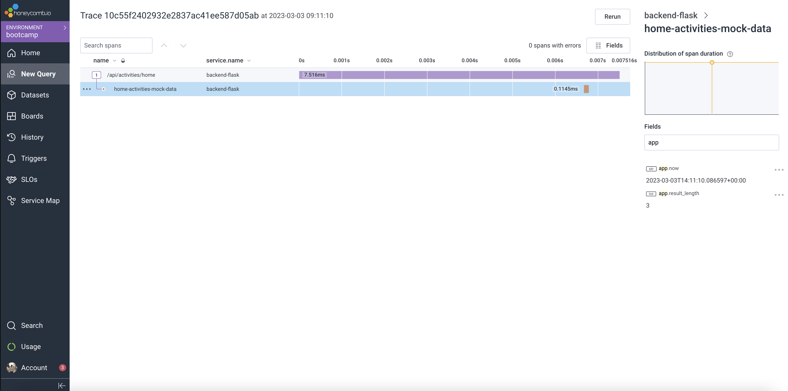

Statistical report is displayed below:
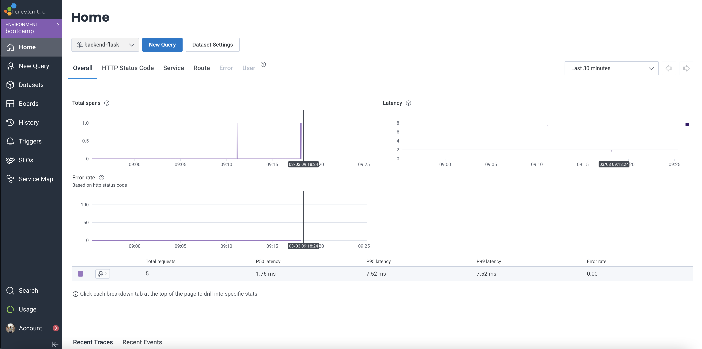

I created a board that shows durations time in ms as heatmap and P90 charts:
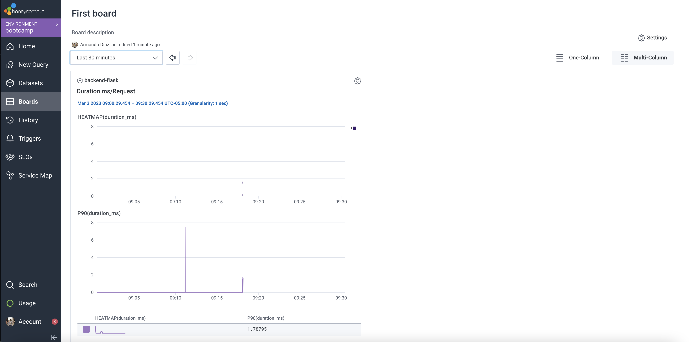

### Traces within AWS XRay

AWS XRay was more challenging than any other provider. I figured it out by trial and error and also consulted the xray blog by [Olley](https://olley.hashnode.dev/aws-free-cloud-bootcamp-instrumenting-aws-x-ray-subsegments) which was helpful to see how you can call attributes from `flask.requests`. However, her implementation did not include information about `put_annotations`. I read the [AWS documentation for AWS Xray API](https://docs.aws.amazon.com/xray-sdk-for-python/latest/reference/basic.html) that explains the data types that must be used to call `put_annotations` and `put_metadata`. That helped me understand how to structure the input data structure and solved all errors.

In addition, I created sampling rules called cruddur for out XRay tracer:

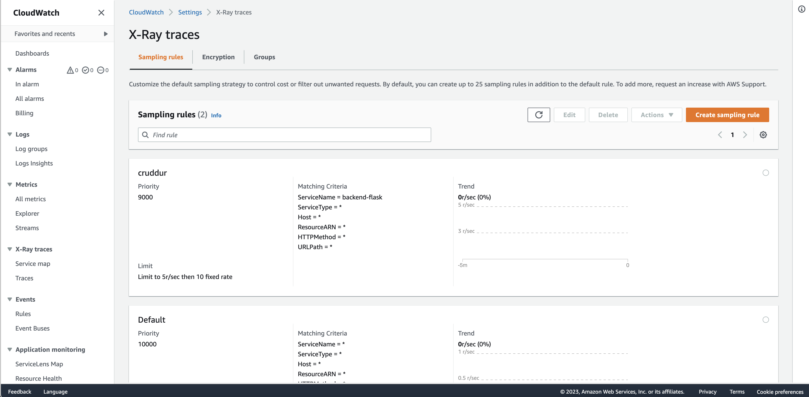

For AWS XRay, the code looks like follows:

```python
elif os.getenv("ENABLE_XRAY_LOG"):
    segment = xray_recorder.begin_segment('home-activities')
    xray_time_dict = {
        "now": now.isoformat()
    }
    segment.put_annotation('now', str(xray_time_dict["now"]))
    segment.put_annotation('method', str(request.method))
    segment.put_annotation('url', str(request.url))

    segment.put_metadata('now', xray_time_dict, 'home-activities-now')
    segment.put_metadata('method', request.method, 'http')
    segment.put_metadata('url', request.url, 'http')

    subsegment = xray_recorder.begin_subsegment('home-activities-mock-data')

    results = HomeActivities.get_data(now)
    xray_results_size_dict = {
        "result-size": len(results)
    }
    
    subsegment.put_annotation('result_size', int(xray_results_size_dict["result-size"]))
    subsegment.put_metadata('result-size', xray_results_size_dict, 'home-activities-mock-data-results-size')

    xray_recorder.end_subsegment()
```

I created annotations and metadata for the segments and subsegments described in the code above.

The annotations are displayed on the right side of the following image:
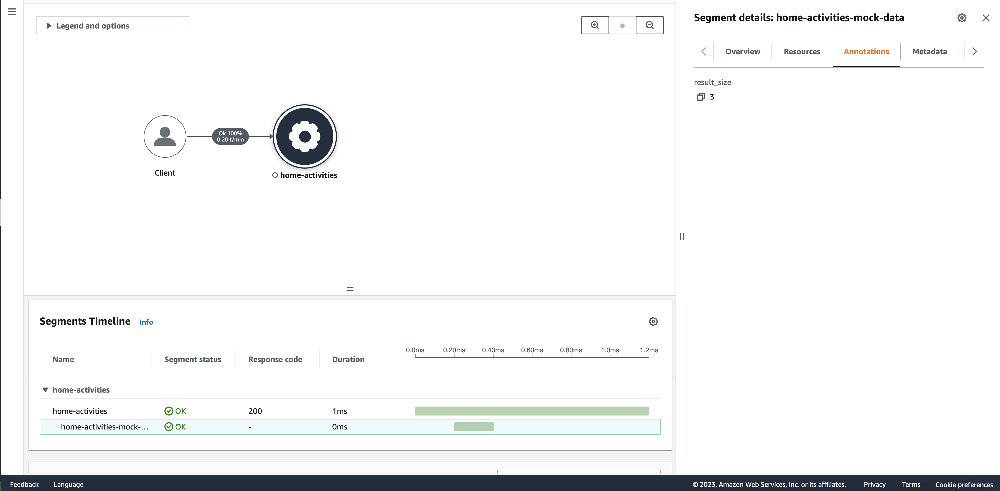

The metadata is displayed on the right side of the following image:
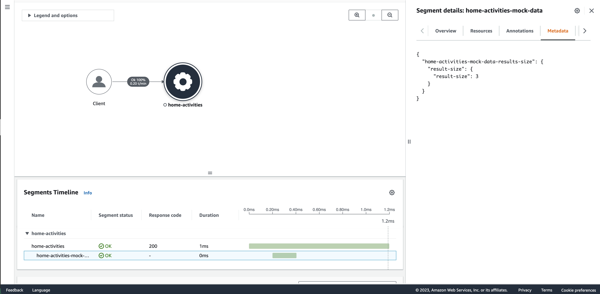

I used the Analytics capability of Xray to query traces, visualize statistics, and filter traces.
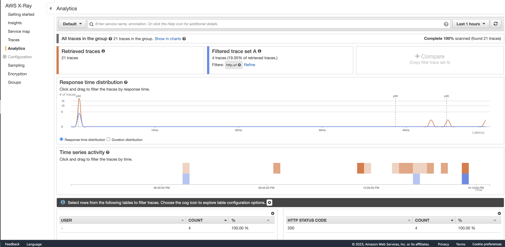

Finally, I queried the traces via CLI.
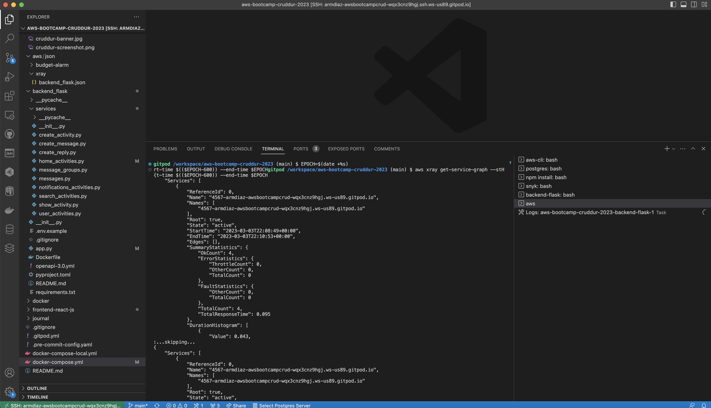

### Traces within Rollbar

Rollbar was one of the easiest tracers that I used in this implementation. I only had to make sure that the initialization of rollbar always return an object to avoid an error when `ENABLE_ROLLBAR_LOG` is not available.

```python
def init_rollbar():
    """init rollbar module"""
    if os.getenv("ENABLE_ROLLBAR_LOG"):
        LOGGER.info("Rollbar logger enabled")
        rollbar.init(
            # access token
            rollbar_access_token,
            # environment name
            'production',
            # server root directory, makes tracebacks prettier
            root=os.path.dirname(os.path.realpath(__file__)),
            # flask already sets up logging
            allow_logging_basic_config=False)

        # send exceptions from `app` to rollbar, using flask's signal system.
        got_request_exception.connect(rollbar.contrib.flask.report_exception, app)
        return 'Hello World!'
    else:
        return 'Hello World!'
```

I triggered a warning saying `Hello world!` and removed a `return result` statement to visualize an error type alarm in Rollbar.
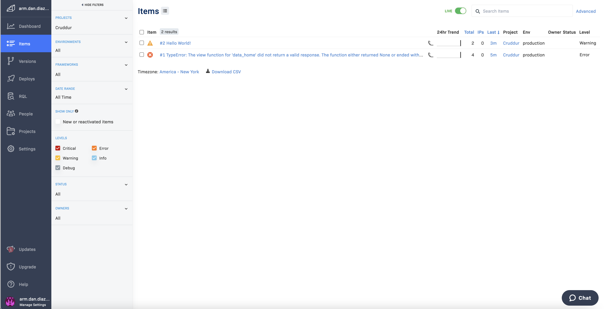

### Traces within AWS CloudWatch

CloudWatch was the easiest tracer that I implementated. I only had to make sure that AWS Credentials were sent in `docker-compose.yml`.

In order to activate cloudwatch, I added the following code:

```python
if os.getenv("ENABLE_CLOUDWATCH_LOG"):
    LOGGER.info("Cloudwatch logger enabled")
    LOGGER.addHandler(cw_handler)
```

An screenshot of the cloudwatch streams sent by our backend are displayed below:
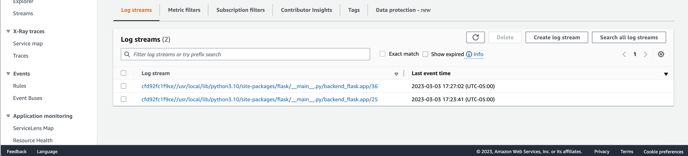

More details of what is going on within our backend are described by clicking one of the streams:
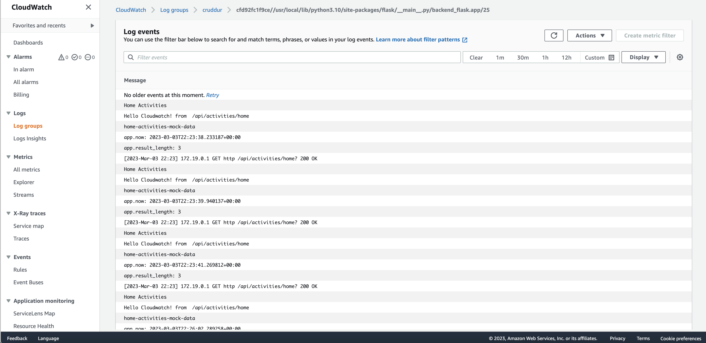
