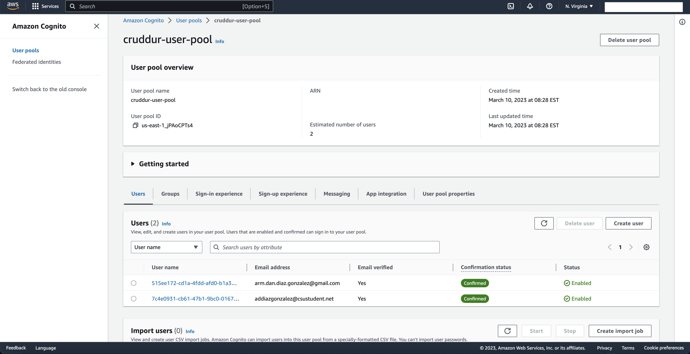
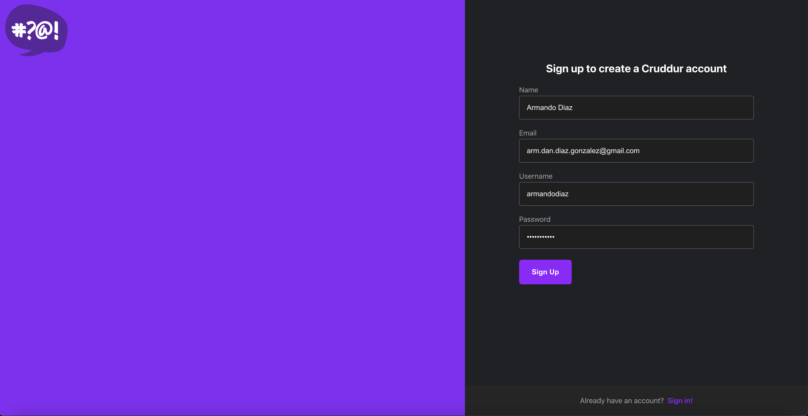
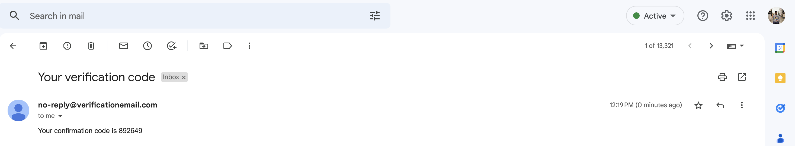
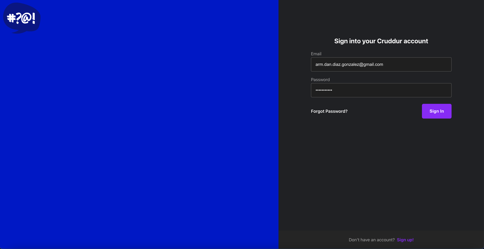
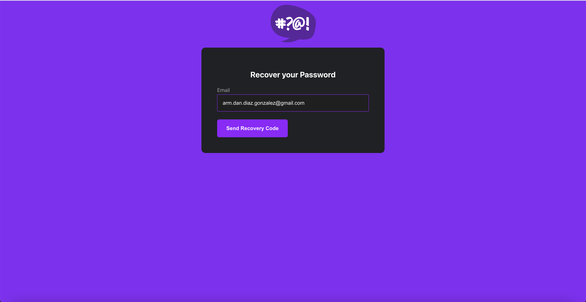
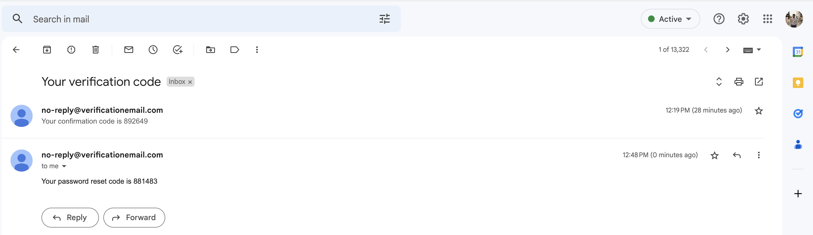
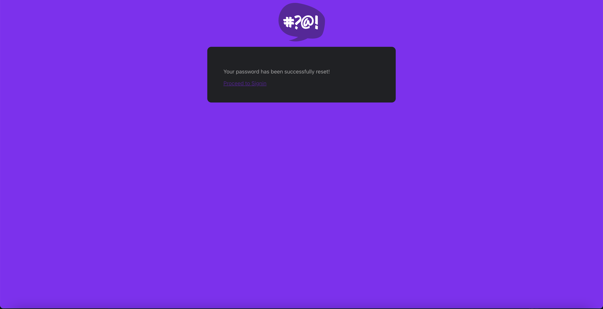
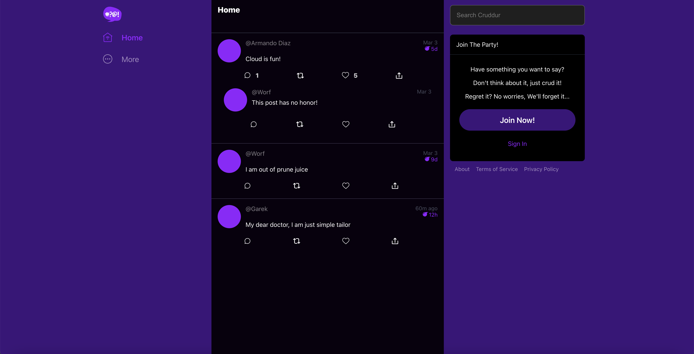
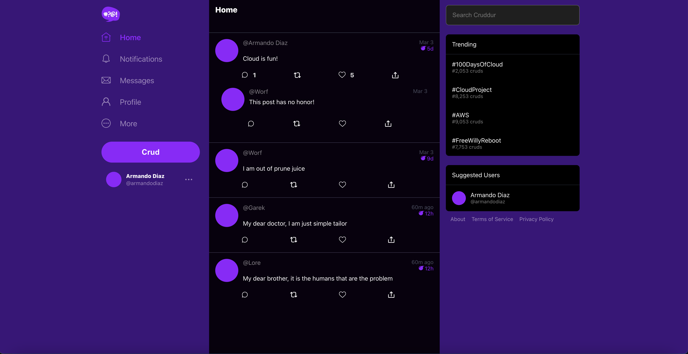
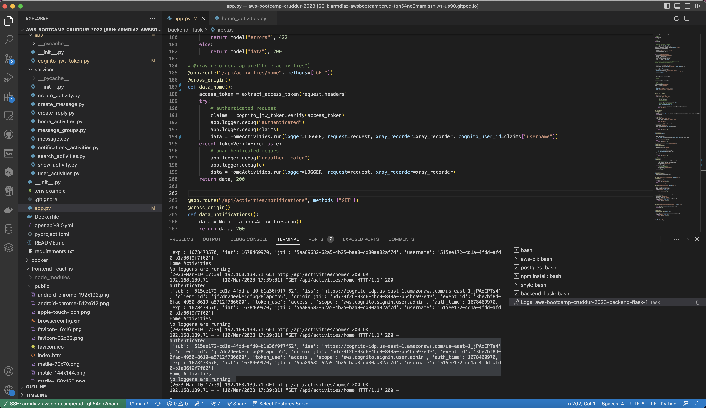

# Week 3 — Decentralized Authentication

## Required Homework/Tasks

### Provision via ClickOps a Amazon Cognito User Pool

In this task, I worked with AWS Cognito User Pool that enables users to sign in to your web app.

To create a user pool, I followed the instructions below:

+ Click on `Create user pool` to start the user pool creation wizard.
+ In Configure sign-in experience, keep default settings and use `Email` as a sign-in option.
+ In Configure security requirements, keep default settings on Password policy and User account recovery. Then, choose No MFA.
+ In Configure sign-up experience, keep default settings on all sections and select the Required attributes `name` and `preferred_username`.
+ In Configure message delivery, choose `Send email with Cognito`.
+ In Integrate your app, use `cruddur-user-pool` as your user pool and name your app `cruddur`. All other settings keep untouched.

No errors were found in this stage.

### Install and configure Amplify client-side library for Amazon Congito

To install `aws-amplify`, you can run `npm i aws-amplify --save ` in your terminal.

To configure `aws-amplify`, I followed all videos our instructor Andrew Brown.

Environment variables are added in `docker-compose.yml` and called in `frontend-react-js/src/app.js`

```js
import { Amplify } from 'aws-amplify';

Amplify.configure({
  "AWS_PROJECT_REGION": process.env.REACT_APP_AWS_PROJECT_REGION,
  "aws_cognito_region": process.env.REACT_APP_AWS_COGNITO_REGION,
  "aws_user_pools_id": process.env.REACT_APP_AWS_USER_POOLS_ID,
  "aws_user_pools_web_client_id": process.env.REACT_APP_CLIENT_ID,
  "oauth": {},
  Auth: {
    // We are not using an Identity Pool
    // identityPoolId: process.env.REACT_APP_IDENTITY_POOL_ID, // REQUIRED - Amazon Cognito Identity Pool ID
    region: process.env.REACT_APP_AWS_PROJECT_REGION,           // REQUIRED - Amazon Cognito Region
    userPoolId: process.env.REACT_APP_AWS_USER_POOLS_ID,         // OPTIONAL - Amazon Cognito User Pool ID
    userPoolWebClientId: process.env.REACT_APP_CLIENT_ID,   // OPTIONAL - Amazon Cognito Web Client ID (26-char alphanumeric string)
  }
});

```

No errors were found in this stage.

### Implement API calls to Amazon Coginto for custom login, signup, recovery and forgot password page

I followed instructions provided by our instructor Andrew Brown. I removed code that was supported using cookies and added functions from `aws-amplify` API to control the login, signup, and recovery page.

For more information about `aws-amplify` in Javascript, see official documentation [here](https://docs.amplify.aws/lib/auth/emailpassword/q/platform/js/)

I created two users using the sign-in page web app. Users and crudder-user-pool is shown below:



#### Sign-up page

The steps to sign-up are described as follows:

+ Fill out sign-up form.



+ Check email from `no-reply@verificationemail.com` that says `Your confirmation code is <CODE>`.



#### login

To login, fill out the sign-in form using your password.



#### Recovery and forgot page

The steps to recover your password are described as follows:

+ Click on `Forgot Password?` and add your `email` in the recovery page form.



+ Check email from `no-reply@verificationemail.com` that says `Your password reset code is <CODE>`.



+ Then, after submitting the recovery code, you should see a message of success.



### Show conditional elements and data based on logged in or logged out

In order to show the difference among the data displayed after logging in and logging out, I added a conditional that appends an array when the user has logged in.

The code can be found in `backend_flask/services/home_activities.py`.

```python
if cognito_user_id != None:
    extra_crud = {
        "uuid": "248959df-3079-4947-b847-9e0892d1bab4",
        "handle": "Lore",
        "message": "My dear brother, it is the humans that are the problem",
        "created_at": (now - timedelta(hours=1)).isoformat(),
        "expires_at": (now + timedelta(hours=12)).isoformat(),
        "likes": 1452,
        "replies": [],
    }
    results.append(extra_crud)
```

and some conditionals under `backend_flask/app.py`

HomePage before logging in:



HomePage after logging in:



At the beggining, I encountered an error because the `cognito_user_id` variable was missing as parameters in the method `HomeActivities.run(cognito_user_id)`. It was an easy fix and the docker logs helped me figured it out.

### Verify JWT Token server side to serve authenticated API endpoints in Flask Application

For this task, I reused the code built in `Flask-AWSCognito`, which is a community-driven python package. Original code can be found [here](https://github.com/cgauge/Flask-AWSCognito/blob/master/flask_awscognito/plugin.py).

The pieces of code that were reused can be found in [backend_flask/libs/cognito_jwt_token.py](https://github.com/arm-diaz/aws-bootcamp-cruddur-2023/blob/main/backend_flask/libs/cognito_jwt_token.py).

I added an `authenticated` and `unauthenticated` to distinguish when the user has logged in. The main two functions that we want to look at are `extract_access_token` and `cognito_jwt_token.verify()`.

```python
cognito_jwt_token = CognitoJwtToken(
    user_pool_id = os.getenv("AWS_COGNITO_USER_POOL_ID"),
    user_pool_client_id = os.getenv("AWS_COGNITO_USER_POOL_CLIENT_ID"),
    region = os.getenv("AWS_DEFAULT_REGION"),
    request_client=None
)

try:
    # authenticated request
    access_token = extract_access_token(request.headers)
    claims = cognito_jwt_token.verify(access_token)
    app.logger.debug("authenticated")
    app.logger.debug(claims)
    data = HomeActivities.run(logger=LOGGER, request=request, xray_recorder=xray_recorder, cognito_user_id=claims["username"])
except TokenVerifyError as e:
    # unauthenticated request
    app.logger.debug("unauthenticated")
    app.logger.debug(e)
    data = HomeActivities.run(logger=LOGGER, request=request, xray_recorder=xray_recorder)
return data, 200
```

Docker logs: Claims


