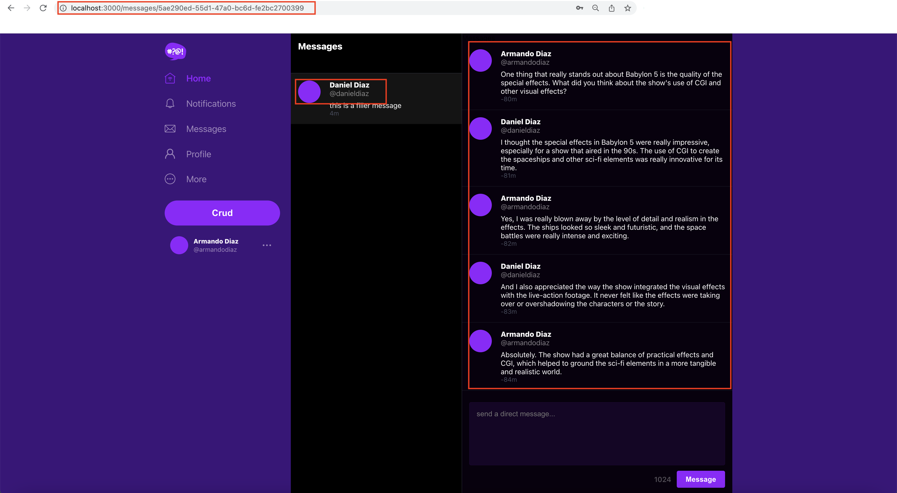

# Week 5 — DynamoDB and Serverless Caching

## Data Modelling a Direct Messaging System using Single Table Design

I learned how to model our data using a Single Table Design to ingest messages from users in the Cruddur web application. This design follows the recommendations of Andrew Brown considering that we have a NOSQL database (DynamoDB).

Data model diagram created by Andrew Brown can be found clickin on [DynamoDB - Data Modelling](https://lucid.app/lucidchart/5a428a17-9094-4eb1-aade-edf28c308482/edit?page=0_0&invitationId=inv_75a3503d-e09d-4180-9ebe-1126e5fdb526#)

We implemented four main access patterns:

+ Pattern A (showing a single conversation)
+ Pattern B (list of conversation)
+ Pattern C (create a message)
+ Pattern D (update a message_group for the last message)

Code is written in Python and can be found clicking on [Access Patterns](https://github.com/arm-diaz/aws-bootcamp-cruddur-2023/tree/main/backend_flask/bin/ddb/patterns).

## Implementation of DynamoDB with DynamoDB Local

**DynamoDB local**  docker image was already added in the docker-compose.yaml file in previous weeks. We included executable files in the directory [backend_flask/bin/ddb](https://github.com/arm-diaz/aws-bootcamp-cruddur-2023/tree/main/backend_flask/bin/ddb). These executable files have the code to help us create a table using DynamoDB local endpoint, populate the table with a simulated conversation between two users, and list the tables available in our database.


One error was found when populating the table running DynamoDB-local. Some hardcoded users caused the program to crash since those users were not available in the database. Tol solve this error, I changed the hardcoded users with users that I use to login.


I also made sure that the Postgres table **users** contained at least two users.


Image below shows the results of pupulating DynamoDB-local by running `./backend_flask/bin/ddb/seed`


After the data ingestion, the conversation is displayed in Crudder.



## Provisioning DynamoDB table and write utility scripts

To provision a DynamoDB table for the Crudder messages, we can run the following command:

```sh
./backend_flask/bin/ddb/schema-load prod
```

The table created has a Global Secondary Index named **message-group-sk-index**.

Andrew Brown enabled **DynamoDB Streams** on the AWS Console after the creation of the DynamoDB table. I added that configuration in script `./backend_flask/bin/ddb/schema-load` and it looks like follows:

```python
  StreamSpecification={
        'StreamEnabled': True,
        'StreamViewType': 'NEW_IMAGE'
    }
```

I faced an error during this phase saying **Token Expired**

The error was triggered because the cognito token expires after a period of time. For now, we have to log out and log in again to generate a new token.


Before creating new messages in Crudder. I created a lambda function to update message groups.


Then, I started a conversation between two users in Crudder.


The new message triggers the lambda function and populates the DynamoDB table.

We can check the lambda function logs by reviewing the cloudwatch logs.


Finally, we can scan the DynamodDB table.


